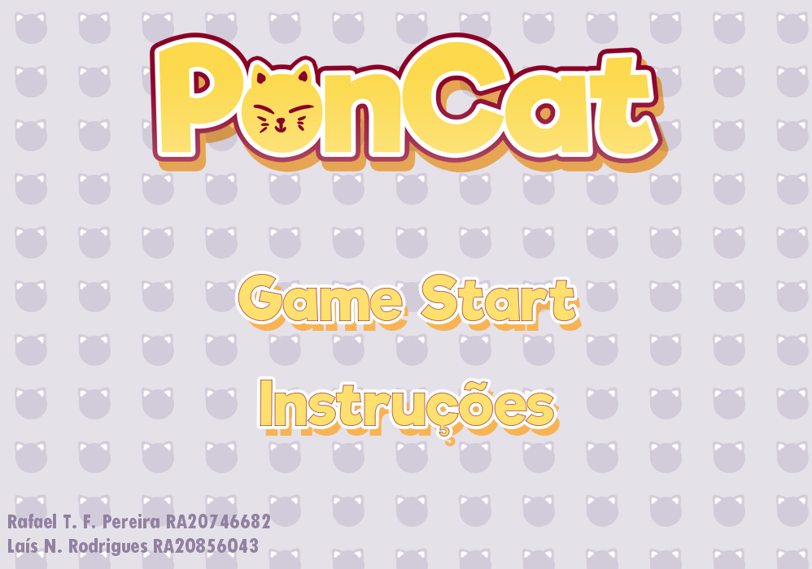
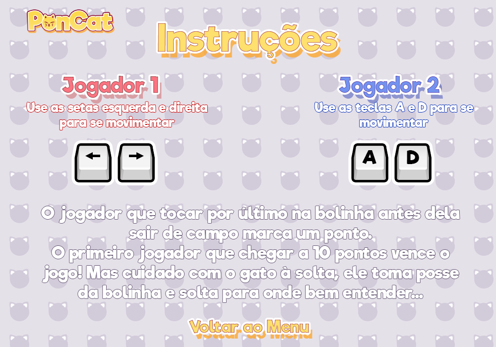
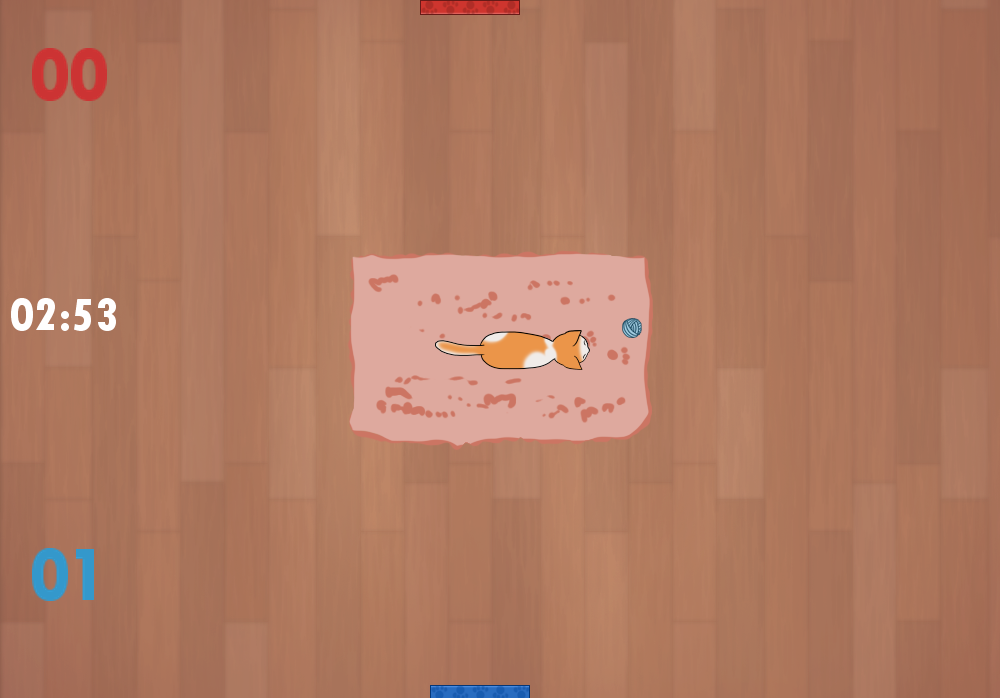
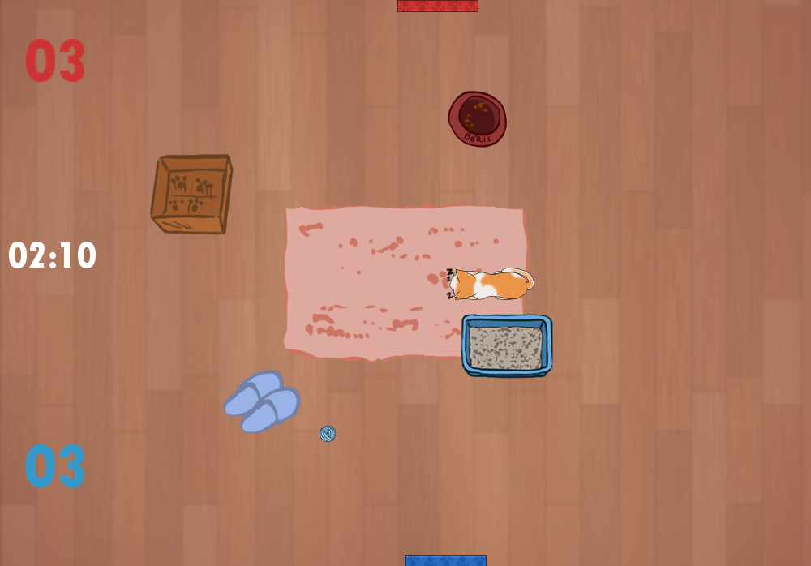
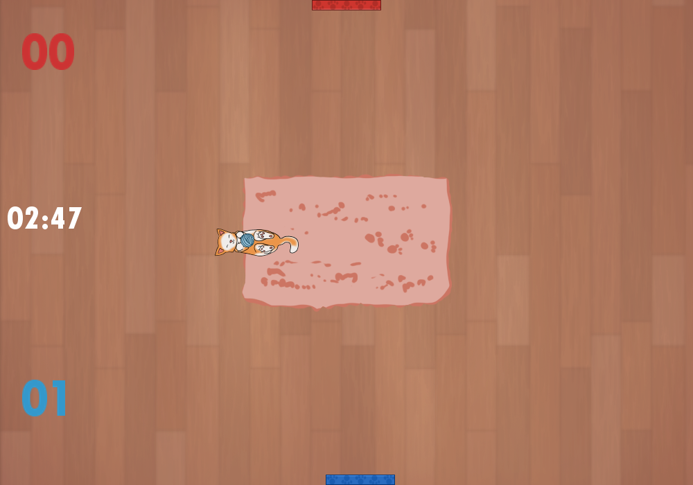
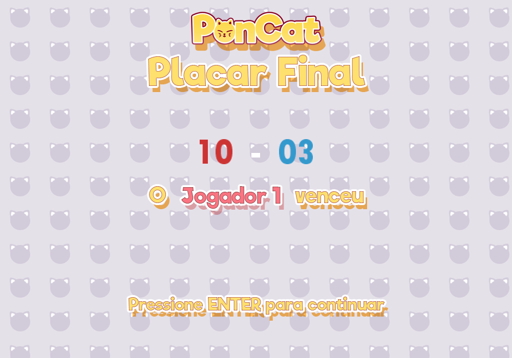

# PonCat

Made with Processing

[PT] Jogo desenvolvido durante o 2º Semestre do curso de Design de Games da Anhembi Morumbi. Uma variação do clássico Pong e desenvolvido no Processing.

[EN] Game developed during 2º Semester of Game Design course at Anhembi Morumbi. A Pong variation developed in Processing.

## Gameplay Video

PonCat gameplay video: https://youtu.be/mmz2JvaX3JM

## Screenshots

## Build

Link to download: https://drive.google.com/open?id=1tfgWGH3-8OF4n-VBhWlQ8RMWuN0e7t6I

## Authors
- **Rafael Taue** - Game Designer and Programmer - [GitHub](https://github.com/rtaue) - [Porfolio](https://rtaue.com) - [LinkedIn](https://www.linkedin.com/in/rtaue/)
- **Laís Rodrigues** - Game Designer and Artist - [ArtStation](https://www.artstation.com/marim) - [LinkedIn](https://www.linkedin.com/in/la%C3%ADs-rodrigues-548261149/)

